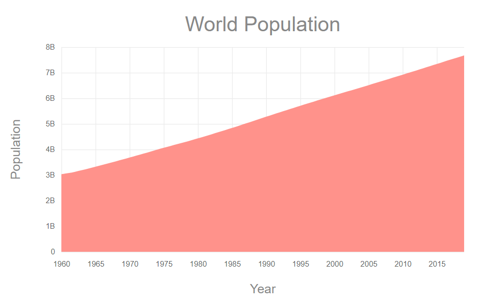
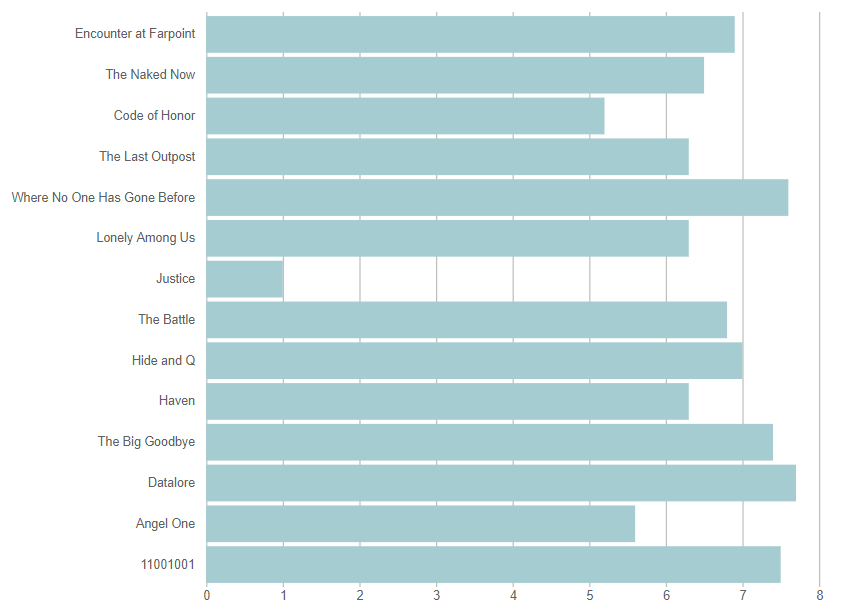
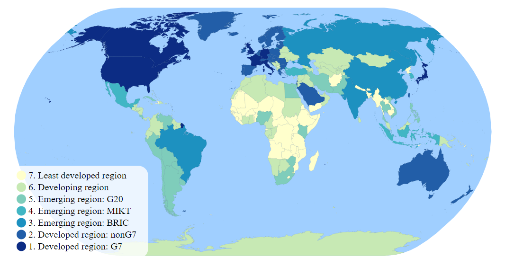
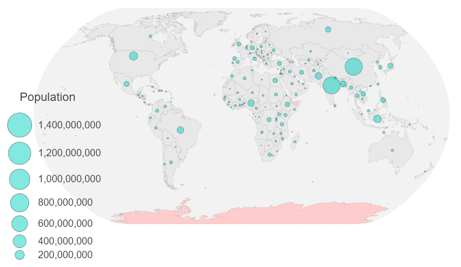
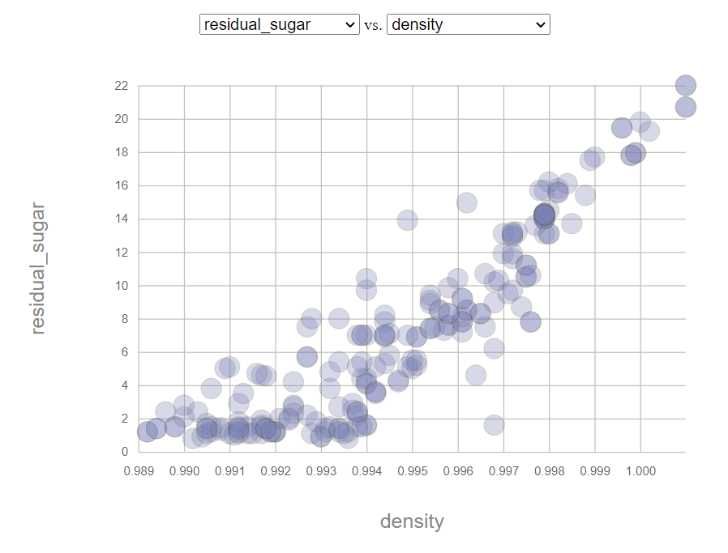

<h1 align="center">
  
</h1>

<h3 align="center">
  Charts - Making charts with D3.js
</h3>

<h4 align="center">
  D3.js + Express + TopoJSON + CSS
</h4>

<br/>

<p align="center">
  <a href="https://github.com/AlexandreMacedoo">
    
  </a>

  

  <a href="https://github.com/AlexandreMacedoo/d3-study/stargazers">
    
  </a>
</p>

<p align="center">
  <a href="#how-to-use">How to use</a>&nbsp;&nbsp;&nbsp;|&nbsp;&nbsp;&nbsp;
  <a href="#charts">Charts</a>&nbsp;&nbsp;&nbsp;|&nbsp;&nbsp;&nbsp;
  <a href="#tecnologies">Technologies</a>&nbsp;&nbsp;&nbsp;|&nbsp;&nbsp;&nbsp;
  <a href="#license">License</a>
</p>

## How to use
To clone and run this application, you'll need [Git](https://git-scm.com), [Node.js v10.16][nodejs] or higher + [Yarn v1.13][yarn] or higher installed on your computer. From your command line:

```bash
# Clone this repository
$ git clone https://github.com/AlexandreMacedoo/d3-study.git

# Go into the repository
$ cd d3-study

# Start the server
$ cd server
$ yarn server

# Choose the type of chart that you want. Ex: choroplethmap
$ cd charts/choroplethmap
# Install all dependencies
$ yarn
# Build the application
$ yarn build

# Now, open the index.html from /choroplethmap/src
```

## Charts
All charts made with d3.js

### Area
<h1 align="left">
  
</h1>

### Bar
<h1 align="left">
  
</h1>

### Choroplet
<h1 align="left">
  
</h1>

### Map with circles
<h1 align="left">
  
</h1>

### Scatter Plot
<h1 align="left">
  
</h1>

## Technologies
This project was developed with the following technologies:

-  [D3.js](https://d3js.org/)
-  [Express](http://expressjs.com/)
-  [TopoJSON](https://github.com/topojson/topojson-client)
-  [VSCode][vc]

## License
The d3-study is open-sourced package licensed under the [MIT license](https://opensource.org/licenses/MIT).

[nodejs]: https://nodejs.org/
[yarn]: https://yarnpkg.com/
[vc]: https://code.visualstudio.com/
